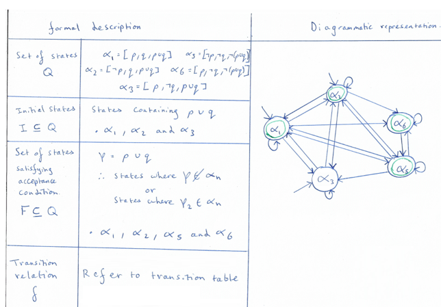

# Linear temporal logic


## Formalisation of LTL

Linear temporal Logic (LTL) is a formal modal logic expressed with time dependency, which can be applied to encode formulae indicative of future states of a system, where LTL formulas are constructured from a set of propositional variables, variables which only take the value of True or False. 

LTL is formulaised by the following grammar:

<div align="center">
 φ = True | a | φ1 | φ1 $\wedge$ φ | $\neg$ φ | Oφ | φ1 $\cup$ φ2   
</div>

<br>

The grammar utilizes standard boolean operators and a set of temporal modal operators, provided in the table belows:

<div align="center">

| Symbol        | Description |                            
| ----------- | ----------- |                           
| $\neg$   | Negation (NOT)     |                            
| $\wedge$   | Conjunction (AND)    |                            
| $\vee$  | Disjunction (OR)        |
| 	$\rightarrow$   | Material implication (IF ... THEN ...)        |
| 	$\leftrightarrow$   | Biconditional (IF and ONLY IF )       |

</div>

<br>

<div align="center">

| Symbol        | Name |     Description |                        
| ----------- | ----------- | ----------- |                         
| $\bigcirc$   | Next  |   $\bigcirc$φ = φ holds at the next state      |                  
| $\diamond$   | Eventually| $\diamond$φ = φ eventually has to hold   |                         
| $\square$  | Always |  $\square$φ = φ holds through the entire computation path|
| 	$\cup$   | Until |  φ1 $\cup$ φ2 = φ2 holds at a future or current state and φ1 holds until this point |
| 	R  | Release     |  φ1 R φ2 = φ1 releases φ2 if φ2 is true for the first position in φ1 is also true |

</div>
<br>

## LTL relation to Transition systems

An application of LTL is to predict the behaviour of an infinite strings within a stream automata, and ultimately provide a method for testing inputs on the models constructed by the framework. 

The computation of an LTL formula over a transition system can be interpreted by the following statements:

<div align="center">

| Keyword | Description |                        
| ------- | ----------- |   
| Path | A Sequence of states visited during a computation|      
| Trace | A Sequence of inputs computed between state transitions during a computational run|   
| Paths(X) | All computational paths within transition system X  |
| Traces(X) | All computational traces observed within transition system X|

</div>
<br>

<div align="center">
<strong>(1)</strong>    T $\models$ φ     iff    q0 $\models$ φ    $\forall$     q0 	$\in$ Q

```console
A transition system, 'T', satisfies an LTL formula, 'φ', if and only if 
all initial states within 'T' also satisfy the LTL formula
```
</div>
<br>

<div align="center">

<strong> (2) </strong>   (1)  iff    trace($\pi$)  $\models$  φ     $\forall$   $\pi$  $\in$ paths(T)

```console
For a state to satisfy a formula, all paths within the 
transition system from the initial state(s) must also satisfy the formula
```
</div>
<br>

<div align="center">
<strong>  (3)</strong>       ∴     Traces(T)   	$\subseteq$   	 words(φ)
 
```console
Therefore traces through a transition system are a subset of words given by the LTL formula φ, 
as traces represent a word within the infinite set of words which can be expressed by φ.
```
</div>
<br>

The accumulation of these three statements is formally known as the **satisfaction relation**.

## LTL equivalence to Stream Automata

As the focus of the framework, Automata which accept infinite traces are Stream automata, where an infinite sequence of states (infinite input) is accepted iff accepting states are visited infintely often, this is known as the acceptance condition. Where stream automata only differ by the formulisation of this base acceptance condition.

The satisfaction relation has shown that LTL formula represent a set of infinite trace which satisfy formula comprosed of atomic propositions. Also, a given Stream automata will accept a set of infinite traces.

∴ A Stream automata exists which accepts exactly the infinite traces represented by the LTL formula


##  LTL to NBA construction procedure

In this section an algorithm approach for the translations of an LTL to a non-determinisitc Buchi Automata is presented, known as the declarative construction algorithm. The algorithm consists of Three key steps:
   
A - Rewritting LTL formula into negated normal form to ensure all formula are in their most simple form which will help with consistency throughout the application of operators.
   
B - Core translation which transforms an LTL formula into a generalized Buchi automata
   
C - Degeneralizsing the construction from an NGA to an NBA

### A - Rewrite formulas


Formulas are in Negated normal form (NNF) iff negations only appear in front of literals, with the following derivable identities used for simplificaiton of a formula:
<div class = row align="center">
<div class = column>
 $\neg$ $\neg$ φ = φ
</div>
<div class = column>                
 $\neg$ $\square$ φ =  $\diamond$$\neg$ φ
</div>
<div class = column>   
 $\neg$$\diamond$ φ =  $\square$$\neg$ φ
</div>
<div class = column>
$\neg$(φ1 $\cup$  φ2) = ($\neg$φ1) $\vee$   ($\neg$φ2)
</div>
<div class = column>
$\neg$(φ1 $\vee$  φ2) = ($\neg$φ1) $\cup$   ($\neg$φ2)
</div>
</div>


This preliminary step before any translation is import as the size of the resultant construction is exponentially proportion to the size of the LTL formula, where size is defined as number of individual literals.

<div align="center">
∴ Simplifications should be applied where possible to decrease the overall complexity.
</div>

### B - Core translation

- Define all sets of closure.

- Define the set of closure atoms.

- Reduce the set of atoms by application of the sequence satisfaction rules.

- Establish the initial states, which are the states containing φ.

- Establish transtiions via the sequence satisifaction rules.

<br>

| Keyword | Description |                        
| ------- | ----------- |   
| Closure - cl(φ) | The set containing all subformulas of φ and their negations |      
| Closure atoms - $\alpha$(φ) | A collection of subsets of the closure(φ) containg EITHER a subformula of φ or its negation|   
| SS rule 1 | For every $\bigcirc$φ $\in$ cl(φ):    $\bigcirc$φ $\in$ $\alpha$i    iff     φ $\in$ $\alpha$i+1|
| SS rule 2 | For every (φ1  $ \cup$   φ2)  $\in$ cl(φ):    (φ1  $ \cup$   φ2) $\in$ $\alpha$i     iff    φ2 $\in$ $\alpha$i    OR    (φ1  $ \cup$   φ2) $\in$ $\alpha$ i+1  |

### C - Degeneralisation

- Consider all possible copes of the automata, each with a distinct accepting state from the set of accepting states repeatedly visited
- Replace incoming edges from accepting states with edges to their equivalent state within the next copy
- This step is fulfilled by the NGA -> NBA conversion algorithm implemented within the framework, hence will not be focused upon in depth during this tutorial.


##  Example

<div align="center">
φ  = p $\cup$ q           φ = 'p until q'
</div>

### A - Rewrite formulas
A relatively simplistic formula has been used for this example, as φ corresponds to a term with the formal grammar of LTL formula, therefore it is already in NNF and also in the simplist form. The emphasis of this example is on the core translation.


### B - Core translation


<div align="center">
<strong> Set of closure </strong>    


 cl (φ)  =  {p,q, $\neg$p, $\neg$q, (p $\cup$ q), $\neg$(p $\cup$ q)}
</div>
<br>

<div align="center">
<strong>  All closure atoms </strong>    
</div>

<div align = "center">
  <div class="row">
    <div class="column">
     $\alpha$1 = {p,q,(p $\cup$ q)}
    </div>
    <div class="column">
    $\alpha$2 = {$\neg$p,q,(p $\cup$ q)}
    </div>
    <div class="column">
    $\alpha$3 = {p,$\neg$q,(p $\cup$ q)}
    </div>
    <div class="column">
    $\alpha$4 = {p,q,$\neg$(p $\cup$ q)} 
    </div>
    <div class="column">
     $\alpha$5 = {$\neg$p,$\neg$q,$\neg$(p $\cup$ q)}
    </div>
    <div class="column">
    $\alpha$6 = {p,$\neg$q,$\neg$(p $\cup$ q)}
    </div>
    <div class="column">
    $\alpha$7 = {$\neg$p,q,$\neg$(p $\cup$ q)}
    </div>
    <div class="column">
    $\alpha$8 = {$\neg$p,$\neg$q,(p $\cup$ q)}
    </div>
  </div>
</div>  
                                                                                                                                 
<div align="center">
   <strong>  Reduce the number of atoms by applying the satisfation sequence rules </strong>      
</div>     
                                     
<div align="center">
<strong>(SS Rule 1</strong>) - φ does not contain the Next operator. This rule is negligible for this translation  
<br>   
<br>
<strong>(SS Rule 2)</strong> - $\alpha$4, $\alpha$7 & $\alpha$8 violate.
<br>
<br>
$\alpha$4 = {p,q,$\neg$(p $\cup$ q)}
<br>
$\neg$(p $\cup$ q) 	$\small  \equiv$  $\neg$p $\cup$ $\neg$q
<br>
∴ φ2 = $\neg$q which is not a term within $\alpha$4 (<strong>*Contradiction*</strong>)
<br>
The same can be demonstrated for $\alpha$7 & $\alpha$8
<br><br>
The set of all closure atoms has been reduces to:
$\alpha$ = {$\alpha$1, $\alpha$2, $\alpha$3, $\alpha$5, $\alpha$6}   
</div>            

<br>

<div align="center">
   <strong>   Construct the components of the NGA  </strong>      
</div>                                                

<div align = "center">
  <div class="row">
    <div class="column">
     <strong> (1) </strong> Establish initial states, which are atoms containing p $\cup$ q:
    </div>
    <div class="column">
    q0 = {$\alpha$1, $\alpha$2 & $\alpha$3}
    </div> 
  </div> 
</div>
<br>
<div align = "center">
  <div class="row">
    <div class="column">
     <strong> (2) </strong>Establish accepting states, which are atoms containing not containg p $\cup$ q OR do contain q:
    </div>
    <div class="column">
      F = {$\alpha$1, $\alpha$2 & $\alpha$5 & $\alpha$6}
    </div> 
  </div> 
</div> 
<br>
<div align = "center">
  <div class="row">
    <div class="column">
     <strong> (3) </strong>Establish transitions by inspecting the possible transition between atoms representing them as $\alpha$i & $\alpha$i+1.  
    </div>
    <div class="column">
     If this transition does not violate the satisfication sequence rules then it exists.
    </div> 
  </div> 
</div>
<br>
<div align = "center">
  <div class="row">
    <div class="column">
     Consider the transition from $\alpha$1 to& $\alpha$6:  
    </div>
    <div class="column">
      Let $\alpha$i = $\alpha$1        &         $\alpha$i+1  = $\alpha$6
    </div>
    <div class="column">
    ∴  $\alpha$i = {p,q,(p $\cup$ q)}      &     $\alpha$i+1 =  {p,$\neg$q,$\neg$(p $\cup$ q)}
    </div>
    <div class="column">
    This transition satisfies SS rule 2 as:
    </div> 
    <div class="column">
    p $\cup$ q $\in$ $\alpha$i  and q $\in$ $\alpha$i
    </div> 
    <div class="column">
     The transition from $\alpha$1 to& $\alpha$6 exists
    </div>   
  </div> 
</div> 
<br>
<div align = "center">
  <div class="row">
    <div class="column">
     Now consider the reverse transition from $\alpha$6 to $\alpha$1:  
    </div>
    <div class="column">
      Let       $\alpha$i = $\alpha$6      &       $\alpha$i+1  = $\alpha$1
    </div>
    <div class="column">
    ∴  $\alpha$i = {p,$\neg$q,$\neg$(p $\cup$ q)}     &     $\alpha$i+1 =  {p,q,(p $\cup$ q)}
    </div>
    <div class="column">
     This transition violates SS rule 2 as:
    </div> 
    <div class="column">
    $\neg$(p $\cup$ q) $\in$ $\alpha$i  iff p $\notin$ $\alpha$i and p $\cup$ q $\notin$ $\alpha$i+1
    </div> 
    <div class="column">
     The transition from $\alpha$6 to& $\alpha$1 does not exists
    </div>   
  </div> 
</div> 
<br>

<div align="center">
  <strong>  Repeat this process of transition inspection until a full transition table is constructed </strong>
  <br>
        
</div>  
<br>
<div align="center">
  <strong>  Accumulate all parts to construct the formal definition of the NGA </strong>
  <br>
        
</div>   
       

### C - Degeneralisation

<div align="center">
  <strong>  In order to complete the full translations from LTL to NBA </strong>
  <br>
  <strong>  use the framework conversion NGA to NBA </strong>  
</div>  


                                                    
                                                
